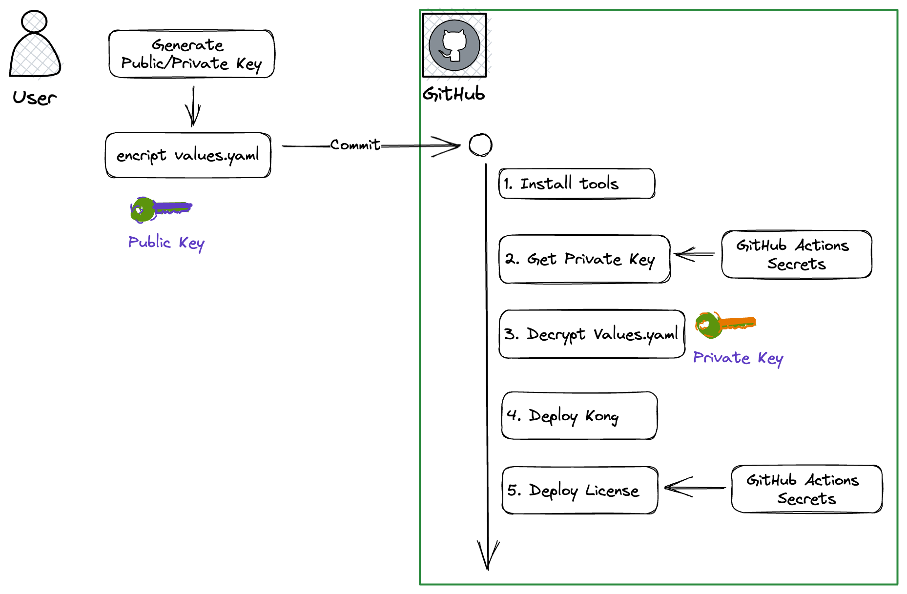

# Kong x Mozilla SOPS Demo

## Introduction

Demo repository on using Mozilla SOPs to encrupt secrets during Kong deployment and configurations.




## Requirements

1. Install [age](https://github.com/FiloSottile/age/releases)
2. Install [sops](https://github.com/mozilla/sops/releases)

We tested this exercise in MacOS, some variation are expected

## Walkthrough

### Generate a key-pair

Let's generate a key pair using age. Pl As you might expect with any other encryption scheme, the public key is the one we use to encrypt (and it’s okay to share), while the secret key decrypts data (and must be kept private, recommend to use a password manager).

```
age-keygen -o sops-key.txt
Public key: xxxx

cat sops-key.txt
AGE-SECRET-KEY-XXXXXXXXXX
```

### Configuring Mozilla SOPS
Next, make encryption easier by creating a small configuration file for SOPS. This allows you to encrypt quickly without telling SOPS which key you want to use. 

Create a .sops.yaml file like this one in the root directory of our repository

```
creation_rules:
  - encrypted_regex: '^(data|stringData)$'
    age: xxxxx-age-public-key
```


### Create a sample Kong Config file

Let's create a sample Kong configuration,and encrypt it using the private key (remember, do not share it)
